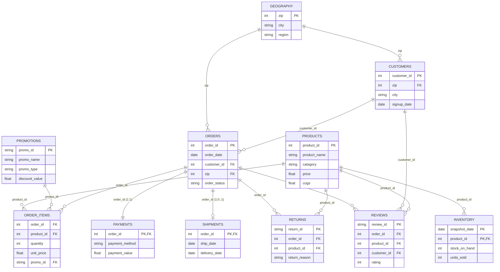

# Datathon 2026 - Data Schema (ERD)

Sơ đồ quan hệ thực thể (ERD) mô tả cấu trúc liên kết giữa các bảng dữ liệu trong hệ thống:

### Chú thích:
- **PK**: Primary Key (Khoá chính)
- **FK**: Foreign Key (Khoá ngoại)
- **||--o{**: Quan hệ 1 - Nhiều (One to Many)
- **||--||**: Quan hệ 1 - 1 (One to One)
- **||--o|**: Quan hệ 1 - Không hoặc 1 (One to Zero or One)
